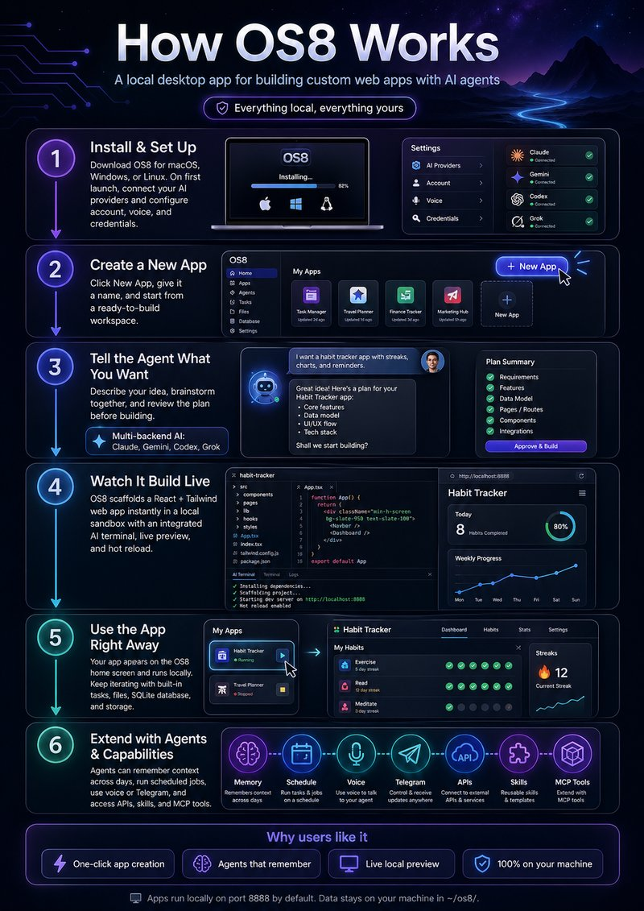
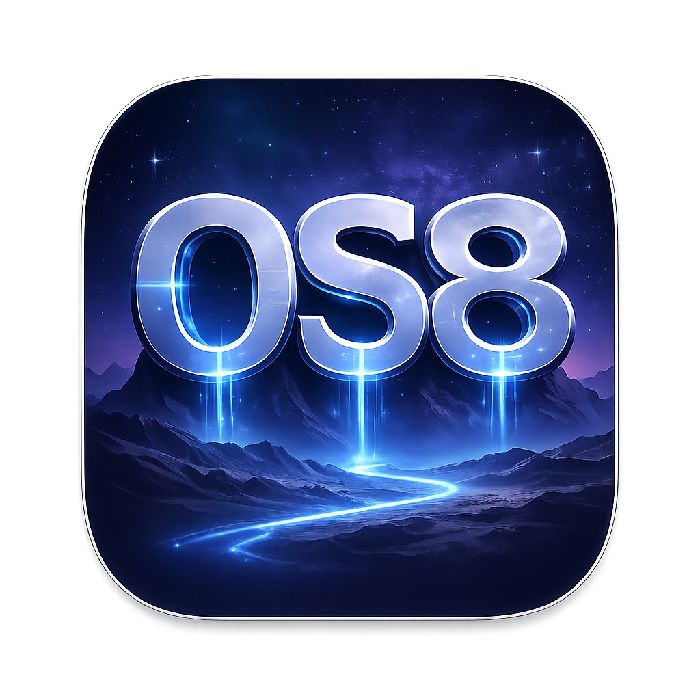

# OS8



A personal operating system for building custom web apps with AI agents. Everything local, everything yours.

Learn more at [os8.ai](https://os8.ai)

<p align="center">
  
</p>

## What is OS8?

OS8 is a desktop app where you create web applications with AI assistance — click "New App," name it, and start building with an integrated AI terminal. No setup, no boilerplate, no cloud dependencies.

- **One-click app creation** — React + Tailwind scaffolded instantly, live preview, hot reload
- **Multi-backend AI** — Claude, Gemini, Codex, and Grok in an integrated terminal
- **AI agents** — Custom agents with memory, scheduled jobs, voice, Telegram, and group chat
- **Capabilities system** — APIs, skills, and MCP tools that agents can discover and use
- **Local-first** — All your data stays on your machine in `~/os8/`

## Download

Get the latest release from [GitHub Releases](https://github.com/os8ai/os8/releases):

- **macOS** — `.dmg` installer
- **Windows** — `.exe` installer
- **Linux** — `.AppImage`

The first launch walks you through setup — AI provider installation, credentials, voice, and account configuration.

## Build from Source

For contributors and developers:

```bash
git clone https://github.com/os8ai/os8.git
cd os8
npm install
npx electron-rebuild -f -w better-sqlite3
npm start
```

**Requirements:** Node.js 22+ (LTS recommended). Supports macOS, Windows, and Linux.

OS8 runs on port **8888** by default (configurable in Settings). Apps are served at `http://localhost:8888/{app-id}/`.

## Features

### App Development
- Create React/Tailwind apps with one click
- AI-powered terminal (Claude, Gemini, Codex, Grok)
- Real-time preview with hot module replacement
- Task management and file browser
- Per-app SQLite databases and blob storage

### AI Agents
- Intelligent model routing across providers
- 4-tier hierarchical memory (raw, session digests, daily digests, semantic search)
- Subconscious memory processor with depth control
- Timed jobs for scheduled tasks
- Telegram messaging integration
- Voice input/output (ElevenLabs + OpenAI TTS) and phone calls
- Multi-agent group chat with moderator turn-taking
- Life simulation (reverie, journal, portraits)

### Capabilities
- Unified system of APIs, skills, and MCP tools
- Auto-discovered from routes, skill files, and MCP servers
- Skill catalog with security review and quarantine
- Google Calendar, Gmail, Drive, image generation, YouTube, and more

## Tech Stack

| Component | Technology |
|-----------|------------|
| Desktop shell | Electron |
| App framework | React 18 + Tailwind CSS 3 |
| Build tool | Vite 5 (middleware mode) |
| Database | SQLite (better-sqlite3) |
| Terminal | node-pty + xterm.js |
| AI backends | Claude Code, Gemini CLI, Codex CLI, Grok CLI |

## Project Structure

```
os8/
├── main.js              # Electron main process
├── index.html           # Renderer HTML shell
├── preload.js           # IPC bridge
├── src/
│   ├── renderer/        # UI modules
│   ├── ipc/             # IPC handlers
│   ├── assistant/       # Agent services (memory, identity, messaging)
│   ├── routes/          # Express API routes (30+)
│   ├── services/        # Backend services (~60 modules)
│   ├── shared/          # Modules shared between shell and apps
│   ├── templates/       # App scaffolding templates
│   ├── db.js            # Database initialization
│   └── server.js        # Express + Vite server
├── styles/              # Modular CSS
├── skills/              # Built-in skill definitions
├── tests/               # Unit tests (vitest)
└── docs/                # Documentation
```

## User Data

All user data lives in `~/os8/` (override with `OS8_HOME` env var):

| Directory | Purpose |
|-----------|---------|
| `apps/` | App source code (React/JSX) |
| `config/` | SQLite database |
| `blob/` | Per-app file storage |
| `core/` | Shared React/Vite/Tailwind |
| `skills/` | Installed skill definitions |

## Documentation

- **[OS8 Project Context.md](OS8%20Project%20Context.md)** — Architecture, philosophy, and data model
- **[OS8-project-design-principles.md](OS8-project-design-principles.md)** — Code patterns and conventions
- **[CLAUDE.md](CLAUDE.md)** — AI development reference (file locations, service index)

## Community

Have a question, idea, or something to show off? Join the [GitHub Discussions](https://github.com/os8ai/os8/discussions).

See [ROADMAP.md](ROADMAP.md) for where the project is headed and [CONTRIBUTING.md](CONTRIBUTING.md) for contribution guidelines.

## License

[MIT](LICENSE)
